<!-- # FaceTrack
## FaceTrack: Asymmetric Facial and Gesture Analysis Tool for Speech Language Pathologist Applications -->

# FaceTrack: Asymmetric Facial and Gesture Analysis Tool for Speech Language Pathologist Applications

<!--  -->

<!-- https://user-images.githubusercontent.com/58986949/115314310-805b2780-a1a7-11eb-8558-648a367ea231.mp4 -->

<!-- Paper ------------------------------------------------>
<!-- Currently a large number of health professionals, more precisely, neurologists and speech language pathologist (SLP), expressed the need to have a tool that allows the extraction of different facial parameters of a patient, through which they can objectively quantify specific characteristics of interest, since, to date these measurements are only based on the subjective vision of the professional. Given this problem, this work presents the development of a novel tool for extracting characteristics of the human face from a video, which serves as a support for SLP professionals during a diagnosis or treatment. The implemented software is not intended to identify and classify any type of patient disease, but rather to be a tool that provides measurable parameters to help the professional to make an objective diagnosis of the patient. -->

<!-- Slides ------------------------------------------------>
Currently, Neurologists and Speech Language Pathologist (SLP) expressed the need to have a tool that allows the extraction of facial parameters of a patient. This will allow **objectively quantify** specific characteristics of interest, since to date these measurements are only based on the **subjective vision** of the professional.

<!--  -->
<!--  -->
<!-- 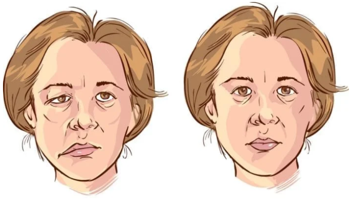 -->
<!-- 
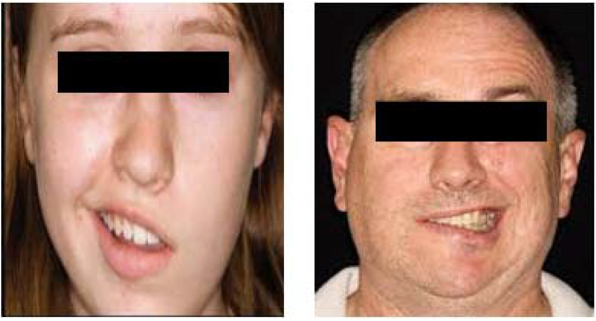

chau chau  -->


<!-- <p float="left">
  
   
</p> -->
<p float="left">
  <p align="center">
  
   
  </p>  
</p>


In this work, a novel tool for facial and gesture analysis aiming to **quantify** different subjective measures employed in the Speech Language Pathologist area is proposed.

It is not intended to identify and classify any type of patient disease,
but rather to be a tool that provides measurable parameters to help
the professional to make an **objective diagnosis** of the patient.

## Highlights
* An adaptation of the 3D face model Candide-3 based on a new set of animation units (AU), is presented for efficiently handling asymmetric facial gestures.
* In the face tracking stage, a new fusion scheme between the adapted 3D symmetric face model and a facial landmarks model is proposed, in order to specifically increase the effectiveness in measuring the parameters of interest.
* A novel set of facial parameters, useful in SLP applications, are defined based on the new set of animation units previously mentioned.
* An application front-end was also developed, in order to facilitate its use.

## Tech Stack
- It is made in C++, using Qt framework, OpenCV 4.3.0 and ALGlib 3.16.0. 


## Related Work
Although there exists a large number of works where different methods to track faces are presented, most of them are focused mostly on applications of video editing, biometric analysis, lip reading, etc., and very few on obtaining facial parameters used in the SLP area.

Moreover, most of them use symmetrical 3D face models, i.e., the movements of the left and right side are the same.

For SLP applications, where a large field of study is facial paralysis, which generally implies that movement on one side of the face (left or right) is partially affected, such an assumption is not acceptable.


## General Information
- This project proposes the study, development and implementation of a computer software tool, which, through a video input that show a person's face in the foreground, you can follow the movement and expressions of the same and thus be able to extract a series of parameters that are of interest in different fields of study, such as speech therapy, neurology, among others.

## Aproach
- For this, advanced digital image processing techniques are combined based on artificial vision and numerical minimization methods. Combining these techniques, facial points of interest were tracked throughout the video and estimation of parameters of the face model used. In this way, it is carried out a tracking of 2D points and they are estimated in a 3D model with the shape of the face of the person under analysis, allowing to obtain quantitative measurements of it. Once processing is completed, the results obtained will be displayed in different interactive graphics and it will be allowed to export them (CSV, pdf, etc.).

- To test the correct operation of the program, several videos were used in different lighting conditions and environment, in which they were analyzed people with partial facial paralysis and healthy people. It was observed that the program is consisting of the results obtained and that the parameters measured in a person they do not vary from video to video. It should be noted that, in the test videos of people with partial facial paralysis, the results obtained for each side of the face  correspond with their partial facial paralysis. The efficiency of the proposed method was evaluated perceptually.


## Asymmetric 3D Face Model
Candide-3 is a parameterized face model deffined by a triangular mesh
structure, and controlled by Shape and Actions Units (SU/AU):
* Shape Units (SU): Deforms base model.
* Global Action Units (AU): Rotations around axes
* Local AU: Face expressions

The model is completely defined by the positions of its 3D points:

<!-- g = g_0 + S*\sigma + A*\alpha -->

<!-- https://latex.codecogs.com/ -->
<p align="center">

</p>

<!-- 

bla bla

 -->

The pose of the face model (P) is given by its position and orientation with respect to the camera:

<!-- {tx; ty; tz; \theta_x; \theta_y; \theta_z} -->
<p align="center">

</p>

So, the full face model is deffined by:

<!-- {tx; ty; tz; \theta_x; \theta_y; \theta_z; \sigma; \alpha} -->
<p align="center">

</p>

Candide-3 Face Model: 

<p float="left">
  <p align="center">
  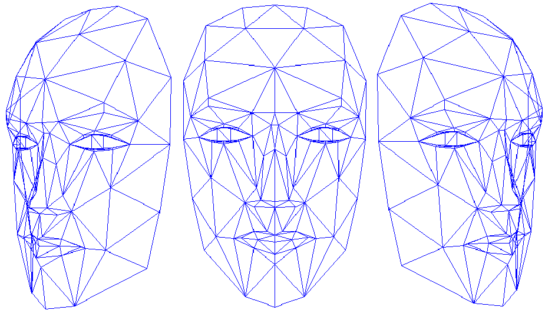
  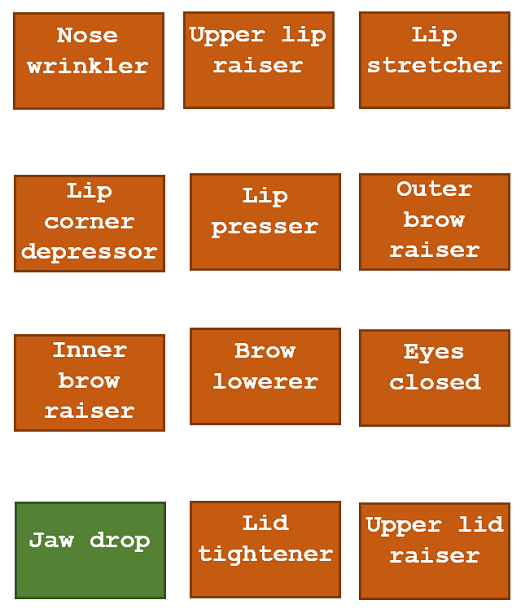 
  </p>
</p>


Proposed Asymmetric Candide-3 Face Model:

<p float="left">
  <p align="center">
  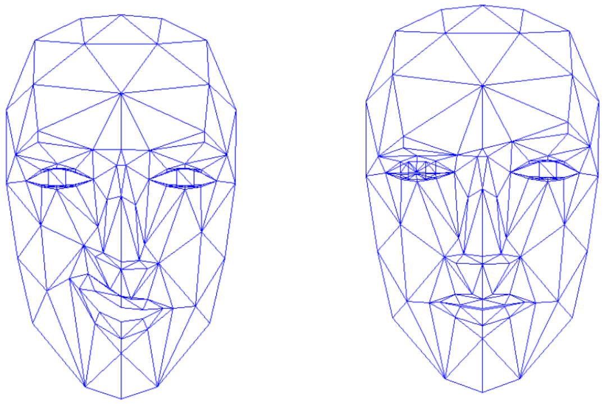
  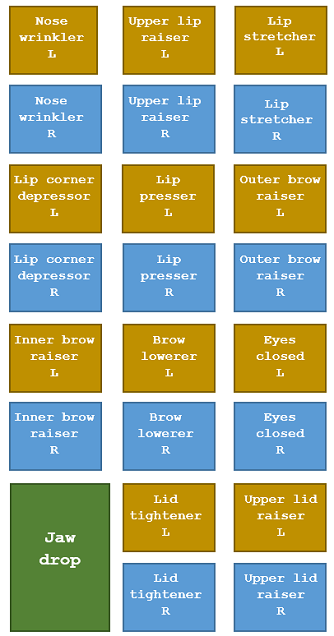 
  </p>
</p>


## FaceTrack

<p align="center">
  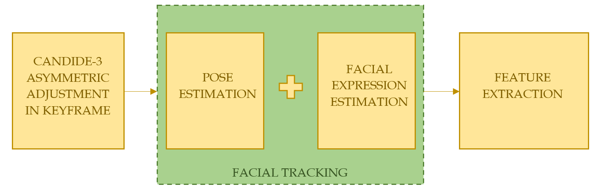
</p>

### Face Model Adaptation
In this stage, the values of the vector &sigma;, which affects the SU, must be chosen in order to fit the 3D model on the person's face.

* Adjust pose P.
* Adjust the position and shape of the eyes, mouth, etc.

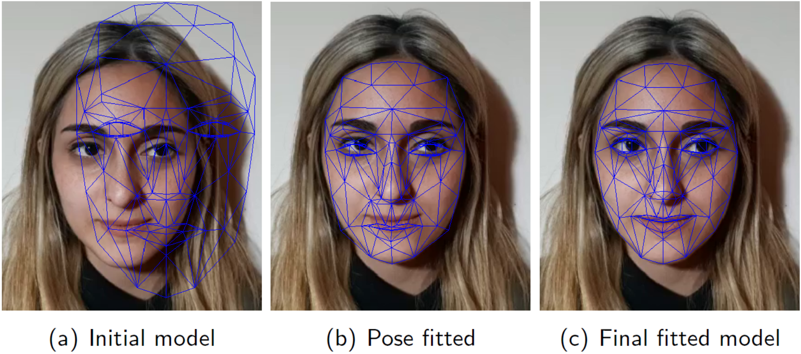

The shape parameter vector &sigma; is obtained and a textured model is generated. This textured face model is then used to create reference images (keyframes), for the estimation of the face pose in each frame of the video sequence.

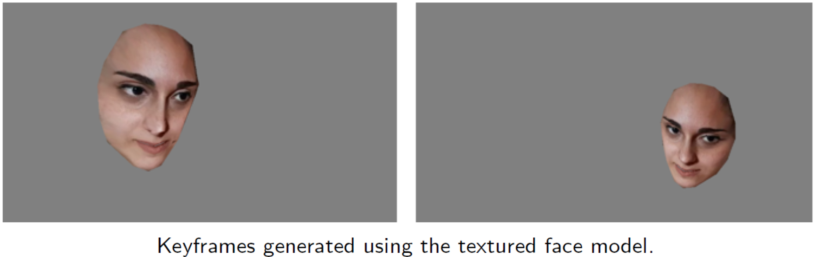


### Pose Estimation
In this stage, three pose estimation are calculated in each frame:

* Based on the previous frame t-1.
* Based on the initial keyframe (rendered with the P_0 pose).
* Based on the keyframe t-1 (rendered with the P_t-1 pose).

Each estimation is based on the projection of a set of vertices of the asymmetric 3D face model, using the iterative optimization method of Levenberg-Marquardt and Lucas-Kanade pyramidal Optical Flow.

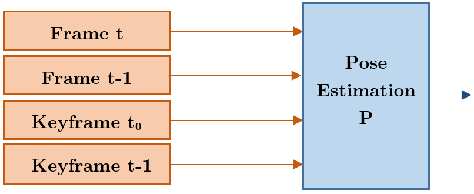

An error metric is defined to select the best pose estimation: the norm between the 2D point tracked by Optical Flow and the 2D projection of the 3D vertex obtained with the pose estimated by the Levenberg-Marquardt method,


### Facial Expression Estimation
In this stage, the values of the vector &alpha; are determined. Two facial expression are calculated in each frame:

* Based on the previous frame t-1.
* Based on facial landmarks.

A method based on Local Binary Features is employed to detect 68 facial landmarks of the face. A Kalman filter is employed to improve the stability problem inherent to any facial landmark method, in order to reduce the oscillations and bounces.

The same methodology as in the case of pose estimation is employed to determine the best estimate: Levenberg-Marquardt, Lucas-Kanade pyramidal Optical Flow, error metric.

<!-- 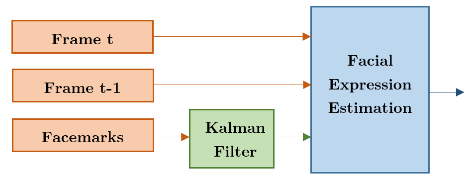 -->
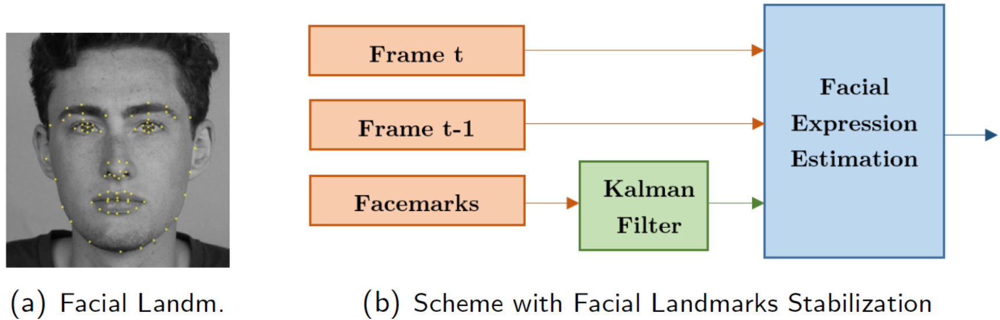


## Features Extraction
After performing the facial tracking, this information (3D point coordinates, AUs activation values, etc.) will be processed to extract the features or morphological parameters of interest.

Since the aim of the proposed tool is to assist health professionals,
especially SLP, the selected features (distances and facial gestures)
were designed in conjunction with a group of SLPs.

### Distance Measurements

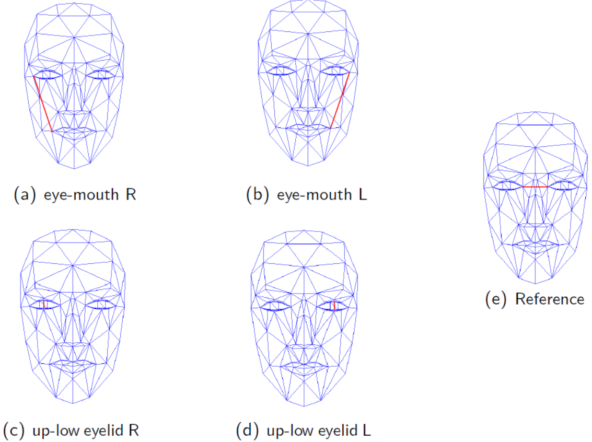


### Facial Gesture Measurements
Facial gestures are a combination of different facial movements, and therefore they can be measured through an appropriate combination of the activation levels of the AUVs proposed in work.

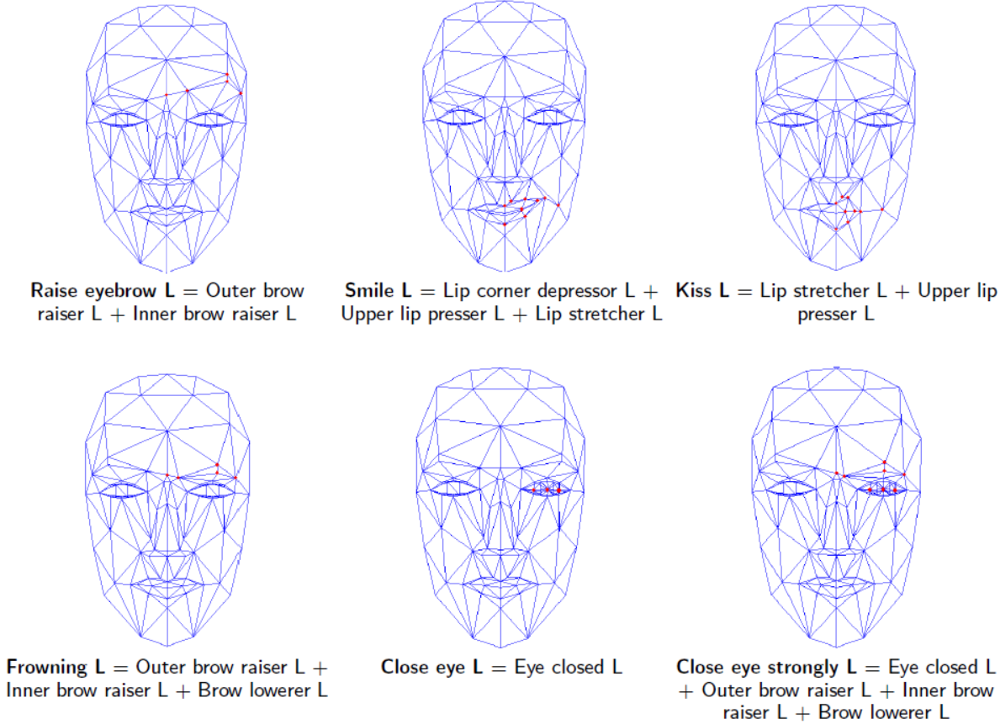
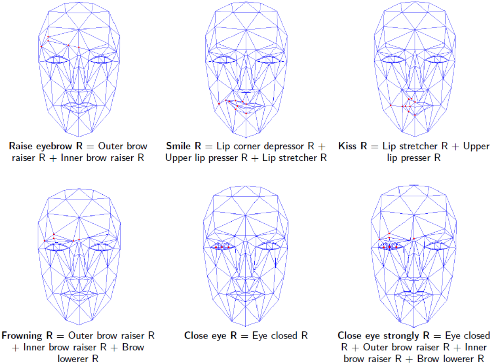


## Evaluation
* P1: Patient without any condition or facial paralysis.
* P2: Patient with a facial paralysis on the left side of the face.
* Setup: Patients repeat 3 times each of the 6 gestures proposed in this work.

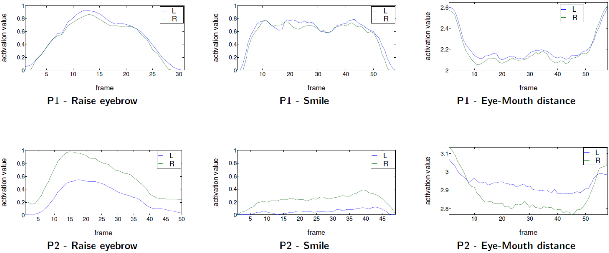
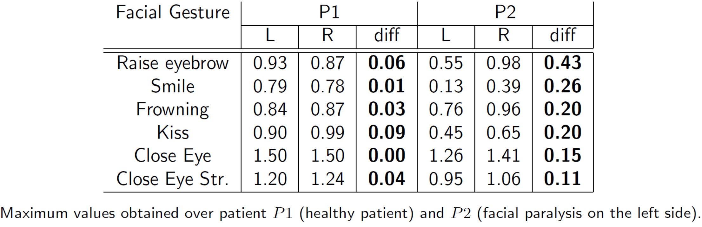


* P1 results: The measurements obtained are similar for both sides of the face.

* P2 results: Left values are always lower for facial gestures and always higher fordistance measurements, which is consistent with the left facial paralysis.

**FaceTrack allow detecting asymmetric gestures and can also quantify such asymmetry**


## How to use?

### Compile
The source code (C++) of FaceTrack is in the folder "FaceTrack/Source_code".
It was developed using Qt framework, so you must to have Qt installed in your PC. 
Two external libraries were employed:

* OpenCv &#8594; OpenCV 4.3.0 
* ALGlib &#8594; ALGlib 3.16.0. 

In order to compile the FaceTrack source code with Qt, first you have to download and compile this two libraries.

Keep in mind that you must then configure the directories of these libraries in the configuration file "FaceTrack/Source_code/InterfazCandide.pro", so Qt can find these libraries.

### Install
If you only want to use the program (you do not want to compile it from source), you can use the installer located in "FaceTrack/Installers/setup.exe". Just double click and the installer will install the program.
This is a FaceTrack Installer only for Windows (see the video tutorial "FaceTrack/Video_tutorials/FaceTrack_installation.mkv" for detailed instructions).

## Citation
This project was initially developed by Facundo Reyes and Julián Alvarez under the supervision of PhD. Gonzalo Sad in FCEIA, Universidad Nacional de Rosario, Argentina. 

If our code helps your research, please consider citing the following paper:

```
Gonzalo D. Sad, Facundo Reyes, and Julián Alvarez. 2021. FaceTrack: Asymmetric Facial and Gesture Analysis Tool for Speech Language Pathologist Applications. In Proceedings of the 1st Workshop on Facial Micro-Expression: Advanced Techniques for Facial Expressions Generation and Spotting (FME'21). Association for Computing Machinery, New York, USA, 1–10. DOI:https://doi.org/10.1145/3476100.3484460
```


**Bibtext:**
```
@inproceedings{FaceTrack_2021,
author = {Sad, Gonzalo D. and Reyes, Facundo and Alvarez, Juli\'{a}n},
title = {FaceTrack: Asymmetric Facial and Gesture Analysis Tool for Speech Language Pathologist Applications},
year = {2021},
isbn = {9781450386838},
publisher = {Association for Computing Machinery},
address = {New York, NY, USA},
url = {https://doi.org/10.1145/3476100.3484460},
doi = {10.1145/3476100.3484460},
booktitle = {Proceedings of the 1st Workshop on Facial Micro-Expression: Advanced Techniques for Facial Expressions Generation and Spotting},
pages = {1–10},
numpages = {10},
keywords = {asymmetric 3d face model, face tracking, gesture analysis},
location = {Virtual Event, China},
series = {FME'21}
}
```

<!-- ```
@inproceedings{Sad_Reyes_Alvarez_2021,
  title={FaceTrack: Asymmetric Facial and Gesture Analysis Tool for Speech Language Pathologist Applications},
  author={Sad, Gonzalo D. and Reyes, Facundo and Julián, Alvarez},
  booktitle={Proceedings of the 1st Workshop on Facial Micro-Expression: Advanced Techniques for Facial Expressions Generation and Spotting (FME'21)},
  year={2021}
}
``` -->
